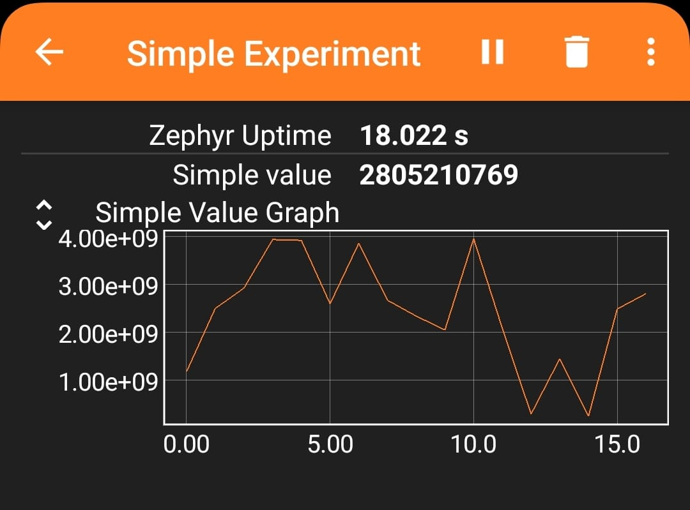

# Zephyr Phyphox BLE Module


Zephyr module that enables the integration of the [Phyphox](https://phyphox.org/) app to transmit data over its BLE [custom service](https://phyphox.org/wiki/index.php/Bluetooth_Low_Energy).

## Requirements

- Zephyr OS v3.x
- Python 3
- C++ >=17

## Tested boards

- [nrf52833dk_nrf52833](https://docs.zephyrproject.org/2.6.0/boards/arm/nrf52833dk_nrf52833/doc/index.html)
- [esp32](https://docs.zephyrproject.org/latest/boards/xtensa/esp32/doc/index.html)

## BLE

This module allows to easily integrate the phyphox ble service. This service is mainly used to transmit the phyphox experiment and get data from events that occur during the experiment. When using this module be sure to allow at least MTU size of 100 bytes. In addition, the phyphox uuid has to be advertised to allow to transmit the experiment over BLE in the phyphox app. Check the `examples` directory for a template on how to integrate this in zephyr.

API Documentation:  https://iaam_embedded.pages.fh-aachen.de/zephyr/ble/zephyr_phyphox-ble/. 

## Phyphox experiment

The library requires as input a phyphox experiment (.phyphox extension). This experiment should be tailored for the specific BLE application. The library converts this experiment to a raw C array of data which is internally used to transmit the file to the phyphox app. The experiment is currently stored in RAM to allow dynamic modification of some fields at run-time (see below).

## Custom fields

Some fields from the phyphox xml can be modified to personalize the experiment and create a unique id which can be loaded to phyphox. This is useful in case that you will deploy the same firmware to different devices. If you have the same BLE Name or experiment title, then each time you load it in the phyphox app it is difficult to pinpoint which device is currently connected or to filter which BLE Name you want to connect to. 

### Experiment title

Placeholder: Does not apply. For the title you can add a dummy text which can then be replaced via the API.

Example:
- `<title>My dummy placeholder example</title>`

To replace the placeholder the user has the API `phyphox_ble::experiment::set_title`

Note: Due to simplification reasons, the api `phyphox_ble::experiment::set_title` requires that the new title must be less than or equal to the length of the placeholder. Otherwise the experiment would need to be adjusted dynamically and the allocated size of the array would need to change at run-time.

### BLE Input Name

Placeholder: `ble_name_in_placeholder`. Example:
- `<input><bluetooth name="ble_name_in_placeholder">`

To replace the placeholder the user has the API `phyphox_ble::experiment::set_blename_in`


## Installation

1. Clone this repository and add it to your main zephyr project

```bash
git clone https://git.fh-aachen.de/iaam_embedded/zephyr/ble/zephyr_phyphox-ble.git --recurse-submodules 
```
2. Add the module to your zephyr [extra modules](https://docs.zephyrproject.org/latest/develop/modules.html) path
```cmake
set(ZEPHYR_EXTRA_MODULES ${PATH_TO_PHYPHOX_BLE_MODULE}
    )
```

3. Indicate the path where the phyphox experiment for your application is located

```cmake
set(PHYPHOX_EXP  ${CMAKE_CURRENT_SOURCE_DIR}/experiment.phyphox CACHE STRING INTERNAL)
```

## Examples

### Simple experiment

Located in `examples/simple_experiment`, this example consists of the integration of this zephyr module and how it can be integrated with a custom ble service to show how data can be transmitted to the phyphox app. The demo includes a simple experiment located in `examples/simple_experiment/experiment.phyphox`. This experiment can be loaded in the phyphox [editor](https://phyphox.org/editor/) to understand how it works or for further modifications.

The example continously sends the uptime (seconds) of the zephyr kernel and a random value. These values are sent as notifications over a custom ble service located in `examples/simple_experiment/src/demo_service.hpp`.

To test the example open the phyphox app and the experiment either via the phyphox editor (QR Code generation) or download it over BLE. The experiment should look as follows:



#### Build

##### West

```bash
west build -b nrf52833dk_dk examples/simple_experiment
```

Note: to build with west the zephyr sdk and toolchain must have been installed before. For further details check https://docs.zephyrproject.org/latest/develop/getting_started/index.html.

##### VSCode

If working with an NRF MCU you can install zephyr via [NRF Connect SDK](https://developer.nordicsemi.com/nRF_Connect_SDK/doc/latest/nrf/index.html) and add the example as an NRF application over their [VSCode plugin](https://www.nordicsemi.com/Products/Development-tools/nRF-Connect-for-VS-Code/Tutorials).

1. Open the NRF connect plugin and select: + Add an existing application
2. Locate the folder where you cloned this repository
3. In the "Applications" category of the NRF connect plugin look for the "simple_experiment" project and click Add Build Configuration.
4. Select a board.
5. Click "Build Configuration"  

## Contact

Contact for issues, contributions as git patches or general information at chavez-bermudez@fh-aachen.de
